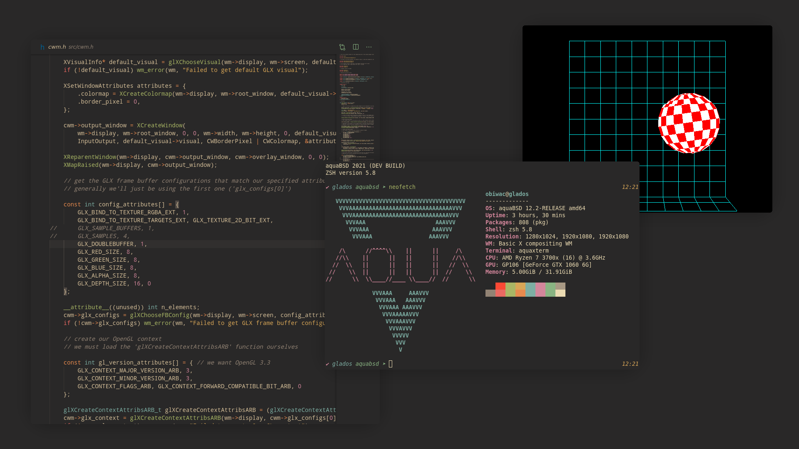

# x-compositing-wm

Extremely basic X11 compositing window manager written in C with Xlib and OpenGL.



## Disclaimer

This is very much *not* intended for use, but merely as a tool to (hopefully) help understand how to write an X11 compositing window manager better than what the quite frankly pisspoor documentation provides.
As such, many best practices are not employed, and a lot of features you'd want to implement aren't implemented (list near the end of this document).
It's also worth noting that I'm in no way shape or form an expert on X, this was just a weekend project that works by miracle.

This was also originally meant as a prototype to AQUA's `wm.*` devices, so some coding decisions and comments may seem a bit strange.

I may or may not end up updating this with these features, but I welcome any pull requests you might have!

## Compiling and installing

On Linux or *BSD or whatever, compile with:

```sh
$ cc -Isrc -I/usr/local/include -L/usr/local/lib -lX11 -lGL -lGLEW -lXcomposite -lXfixes -lXinerama -lm src/main.c -o x-compositing-wm
```

This creates an `x-compositing-wm` executable which you can put anywhere really (like `/usr/local/bin/` or `~/.local/bin/` or whatever).
You can then set this to run automatically when you run `startx` by adding something like this to the end of your `~/.xinitrc`:

```sh
exec x-compositing-wm
```

## Features

- Basic window interaction.
- Basic graphical effects (shadows, rounded corners).
- Basic.
- Basic animations (smoothing when moving/resizing windows, animations when creating windows, &c).
- Basic EWMH compliance (so it can work with programs like OBS).

## Default keybindings

- Super+Left click and drag: Move window.
- Super+Right click and drag: Resize window.
- Super+F1: Quit WM.
- Super+F: Make window fullscreen.
- Super+Alt+F: Make window fullfullscreen.
- Super+V: Enable or disable vsync (GIMP doesn't work with vsync for reasons I haven't had time to investigate).
- Super+R: Restart WM.
- Super+T: Open xterm instance.

## List of things you'll want to add in your own compositing WM

- More error handling.
- A fallback for when modern OpenGL (3.3) is not available.
- Probably use `XDamage` to not needlessly update regions of the screen that don't need updating, although TBH I'm not sure if these days it's really a big deal.
- Freeing allocated memory correctly.
- Capturing focus events so clients can ask for focus (necessary for dropdowns to work properly, which are their own separate windows most of the time).
- Apparently it's better performance-wise to use XCB instead of Xlib these days. You may wanna look into that.
- Make resizing windows not dumb.